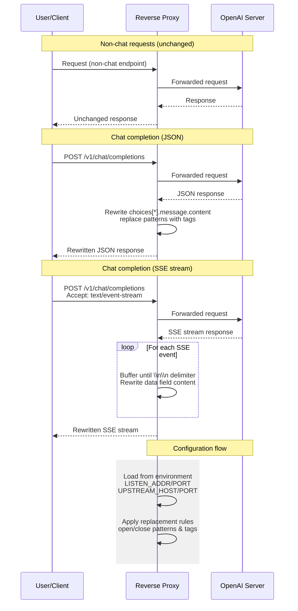

# OpenAI OSS Relay

A tiny reverse‑proxy that forwards HTTP requests to an upstream service while rewriting OpenAI‑style chat completions. Non‑chat endpoints are proxied unchanged. For `/v1/chat/completions`, the proxy inspects the response and replaces configured open/close patterns with custom tags.

## Features

- **Transparent proxy** for all HTTP traffic.
- **Chat completion rewrite**:
  - Supports both JSON responses and Server‑Sent Events (SSE) streams.
  - Configurable pattern matching and replacement tags.
- **Environment variable configuration** for listening address, port, upstream host/port.

## Configuration

The proxy reads its settings from environment variables. The defaults are shown below:

### Architecture Diagram



| Variable        | Default   |
|-----------------|-----------|
| `LISTEN_ADDR`   | `0.0.0.0` |
| `LISTEN_PORT`   | `8080`    |
| `UPSTREAM_HOST` | `127.0.0.1` |
| `UPSTREAM_PORT` | `1234`    |

You can override any of these by setting the corresponding environment variable before running the binary.

### Pattern replacement

The patterns and tags used for rewriting chat completions are defined in `ReplacementConfig::default()`:

```rust
open_pattern: "<|channel|>analysis<|message|>",
close_pattern: "<|end|><|start|>assistant<|channel|>final<|message|>",
open_tag: "<think>",
close_tag: "</think>"
```

Edit `src/main.rs` to change these defaults if needed.

## Building

```sh
# Build the binary (debug)
cargo build

# Or build a release binary
cargo build --release
```

## Running

```sh
# Example using default configuration
cargo run

# Using custom environment variables
LISTEN_ADDR=127.0.0.1 LISTEN_PORT=8081 UPSTREAM_HOST=my.upstream.com UPSTREAM_PORT=5000 cargo run
```

The proxy will start listening on `http://<LISTEN_ADDR>:<LISTEN_PORT>` and forward requests to the upstream service at `http://<UPSTREAM_HOST>:<UPSTREAM_PORT>`.

## License

This project is licensed under the MIT License. See the [LICENSE](LICENSE) file for details.
